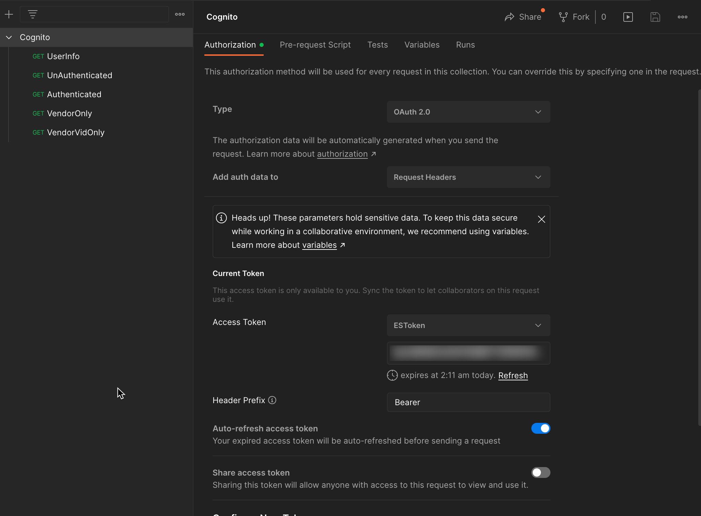
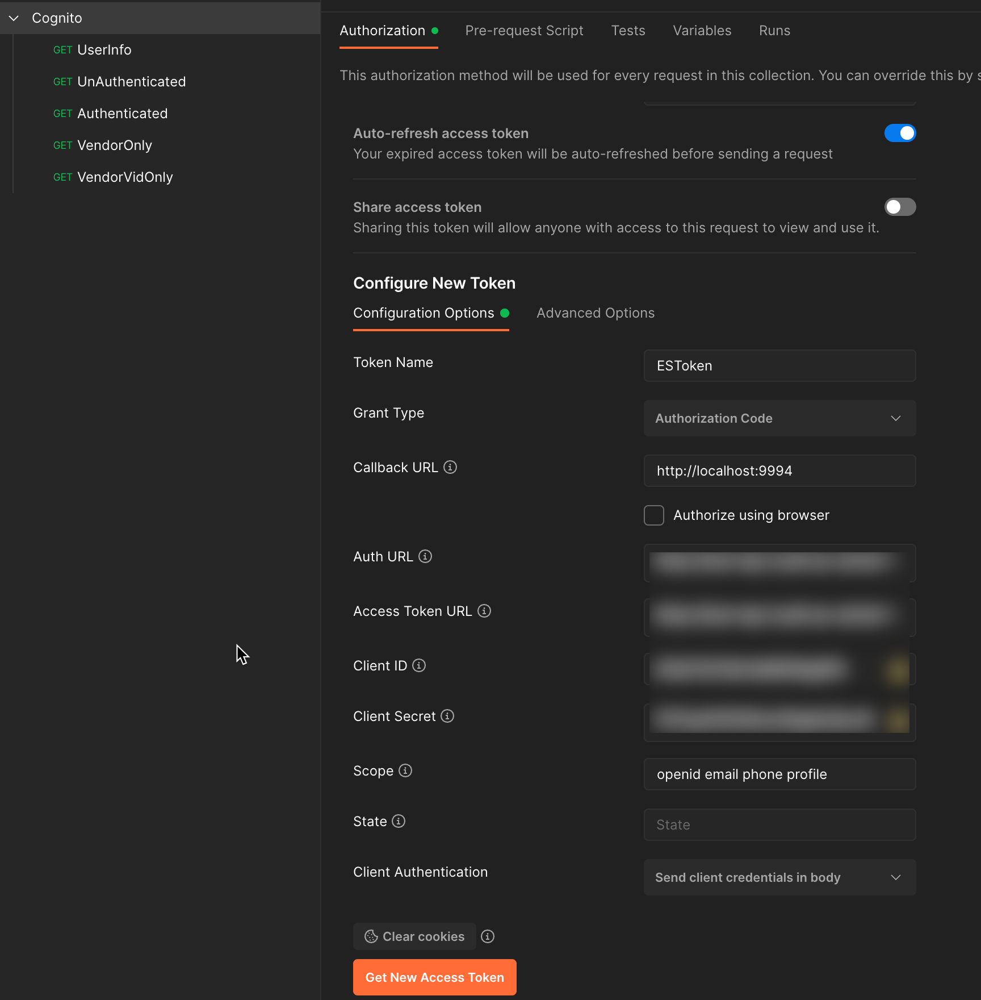
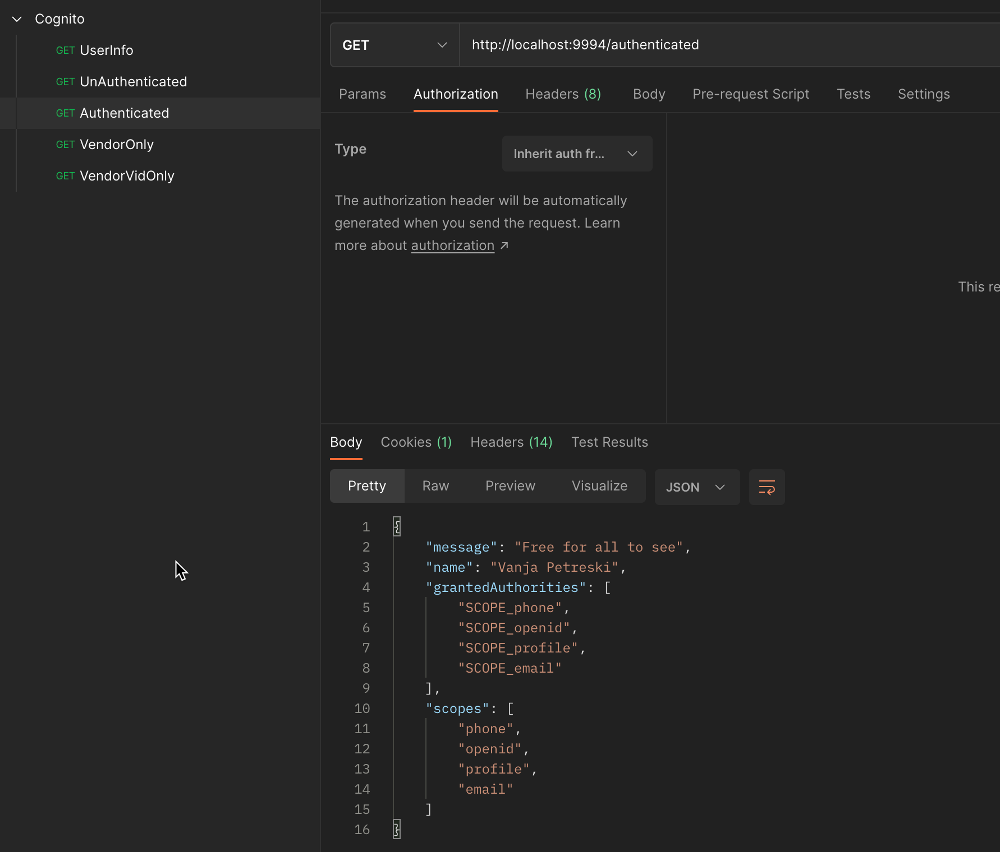

# Boot-Cognito 🔒

Secure REST API via AWS Cognito. You can see it in action [here](https://app.screencast.com/0DP4kaa4OvfXO).

## Requirements

- JDK 17
- Properly configured AWS Cognito and all relevant info provided (secrets, config, urls, etc)

## Usage

Configure sensitive configuration:

```shell
cp src/main/resources/application-private.yml.template src/main/resources/application-private.yml 
```

And then edit `src/main/resources/application-private.yml` and populate it with your secrets and configuration for Cognito.

execute `./mvnw spring-boot:run`

The easiest way to test it is using Postman:





^ `Auth URL` is in format `https://<SUB_DOMAIN>.auth.<REGION>.amazoncognito.com/login`

^ `Access Token URL` is in format `https://<SUB_DOMAIN>.auth.<REGION>.amazoncognito.com/oauth2/token`



## Important Notes

- Since we are here using `Access Token` and not `ID Token`, we have to make additional API call to Cognito to fetch user details / attributes (name, surname, vid)
- Instead of fetching `UserInfo` in controllers, we could extend Spring Security to populate custom user details
- Instead of checking for `VENDOR` and `VID` in controllers, we could implement a filter in security configuration to protect relevant endpoints
- No mapping has been done between Cognito groups and Spring's granted authorities, if we want to use Cognito's groups as Spring Security Roles then proper mapper should be implemented
- We could also use existing and custom annotations to protect endpoints / controller methods

**So basically, this solution is doing manual authorization checks for VENDOR group and VID attribute for demonstration purposes only and because of time limitation, but in real life production scenario this should be automated in a cross cutting way as explained above!**
